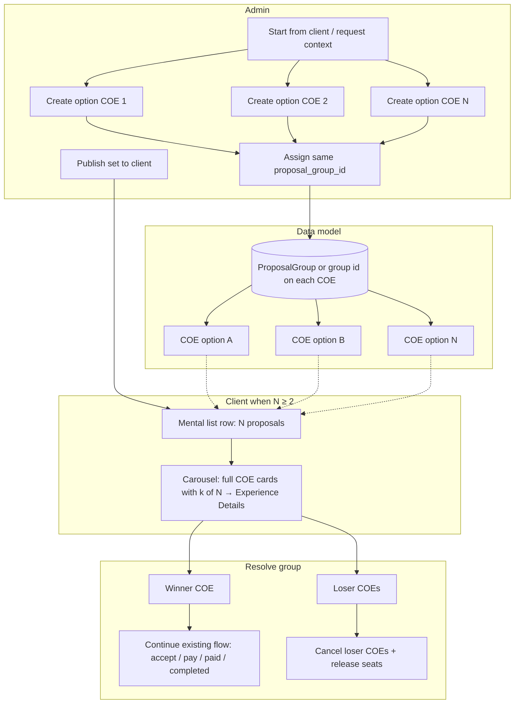
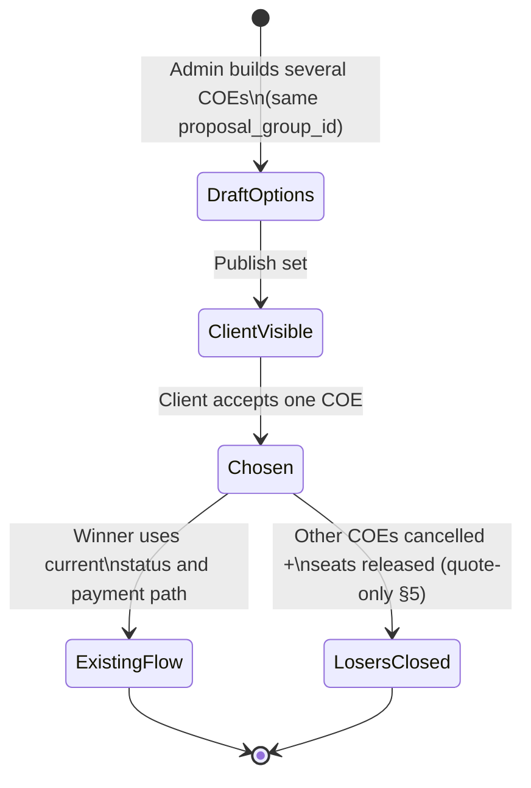

# Multiple COE proposals (design notes)

Working document for extending THE1 so an admin can offer **several alternative experiences** for one client review; the client **accepts one** and the **existing single-COE lifecycle** continues on that winner.

---

## 1. Current system (baseline)

### COE lifecycle (short)

Top-level `COE.status` values include: `draft`, `request`, `approved`, `accepted_not_paid`, `pending_pay`, `paid`, `completed`, `rejected`, `expired`, `cancelled` (see `models/COE.js` and `services/coeService.js` `updateCOEStatus` / `validTransitions`).

### The word "proposal" today

- **`proposal` is not persisted** as a COE status in MongoDB.
- API / service: `status === 'proposal'` is **normalized to `approved`** in `coeService.updateCOEStatus`.
- Admin **Create proposal** in the mobile/bot flow sets tool flags (`admin_create_as_proposal`, deposit percent); after the COE is created as **`draft`**, the bot may transition it to **`approved`** so the client sees it (`botToolHandlers.js`).
- Product language: "proposal" means **publish a client-visible offer**, stored as **`approved`** plus deposit fields.

Implication: **multiple product "proposals"** should not assume a `COE.status === 'proposal'` field; design around **groups of COEs** and/or explicit metadata.

---

## 2. Product goal

1. Reach a **client review** phase where **more than one concrete offer** exists (updates, recommendations, tiers).
2. **Admin** can create and manage **several options**.
3. **Client** sees **all options**, then **accepts exactly one**.
4. **After acceptance**, continue the **current** flow on the **chosen** COE (accept / payment / paid / revision / completed as today).
5. **Non-chosen** options must be **closed** and **inventory** (seats) must stay correct.

---

## 3. Recommended direction: multiple COEs + shared group

### Core idea

- Each option is a **normal COE** (same events/seats/pricing structure you use today).
- Link options with a shared **`proposal_group_id`** (UUID or ObjectId string) **on every member COE**, plus a **`ProposalGroup`** document keyed by that id (see below).

**Decided — `ProposalGroup` collection + id on each COE (robust):**

- **Why not COE-only?** Storing only `proposal_group_id` on each COE forces every resolution/publish rule to **update or read N documents** and makes **open vs resolved**, **chosen_coe_id**, and **timestamps** easier to get wrong under concurrency. A **`ProposalGroup`** document is **one place** for group lifecycle: `status` (`open` | `resolved`), `chosen_coe_id`, `resolved_at`, `client_id`, `created_by`, etc.
- **Why still put `proposal_group_id` on each COE?** Fast membership queries (`find({ proposal_group_id })`), list collapse, and mobile payloads without always joining the group doc.
- **`ProposalGroup` fields (sketch):** `proposal_group_id`, `client_id`, `admin_id` / `created_by`, `status`, `chosen_coe_id`, `resolved_at` (extend as needed).

**COE-only** (id on each COE, no collection) remains possible for a minimal prototype but is **not** the chosen direction for THE1 multi-proposal v1.

### Why not one COE with JSON variants?

A single COE with an embedded array of "variants" forces **every** consumer (payments, seats, bot cards, notifications) to branch on "which variant is active." N separate COEs **reuse** existing paths; you add **grouping + resolve + loser cleanup**.

---

## 4. Lifecycle (narrative)

1. **Admin** builds option A, B, … as COEs, all tagged with the same `proposal_group_id` (while building they can stay `draft`).
2. **Publish** (**decided**): when the admin sends the set to the client, move **all** options in the group to **`approved`** (same visibility rules as today’s proposals). Client list behavior: **grouped** row only when **N ≥ 2**; **N = 1** behaves like a normal single COE (§6.1). A separate status such as `proposal_pending` is **not** required for v1.
3. **Client** on **Experiences** (§6.1–6.2):
   - **Two or more** COEs in the same `proposal_group_id`: list shows **one mental row** (**«N proposals»**); tap → **proposal-picker** carousel of full cards (**k of N** on each slide); tap a slide → **Experience Details** (`/coe-detail`) for that COE; **accept** / decline as today (role-specific §6.2).
   - **Exactly one** COE in the group (or no multi-option group): **no** mental card, **no** proposal-picker — **same as today**: one **`COECard`** row, tap goes **straight to** `/coe-detail`.
4. **Client accepts one** (dedicated action on the chosen COE — from **`/coe-detail`** and/or **Accept** on the proposal-picker carousel, §6.2; or direct list tap when **N = 1**):
   - Validate: COE belongs to group, group `open`, client owns COE.
   - Set group `chosen_coe_id`, `resolved`, `resolved_at`.
   - **Winner**: apply your **existing** transition from `approved` toward `accepted_not_paid` / `pending_pay` / etc. (whatever you use today for "client accepted").
   - **Losers** (**decided**): transition to **`cancelled`** and **release seats** per §5 (quote-only inventory) / existing `releaseSelectedSeats` rules.

5. **Aftermath**: only the winning COE progresses; losers are terminal or archived.

---

## 5. Seat and inventory (critical)

If attaching seats marks them **`selected`** (or similar) on real event inventory, **several open options** can **conflict** on the same seat.

**Decided for v1: quote-only until choice**

- Until the client **Accept**s one option and **`choose-for-group`** completes, options **do not commit** real inventory in a way that blocks the same seat across siblings. Implementation may use a **planning / quoted** representation for seat rows on draft multi-option COEs, or equivalent service rules, so **two options can show the same seat as a quote** without double-booking.
- **After** resolution, only the **winning** COE continues down the normal **paid / selected** path; **losers** are **`cancelled`** (§4) and any tentative attachment is released.

Other policies (for reference only — **not** v1):

| Policy | Idea |
|--------|------|
| **Soft holds** | Time-limited holds per option; expire when group resolves or TTL hits. |
| **Distinct inventory** | Each option uses **different** seats/sections so no overlap. |

Without **quote-only** (or another explicit policy), multi-proposal will cause double-booking or blocked inventory.

---

## 6. Client experience (grouped presentation)

**Principle:** when **two or more** COEs share a `proposal_group_id`, use one **grouped** list entry and a **proposal-picker** carousel until the client **Accept**s and the group resolves; then the grouped UI **is removed** and **only** the winning COE appears as a normal list row (§6.4). **Others** are closed **explicitly on the server**. When only **one** COE belongs to that group, **do not** use the grouped carousel — use the **existing single-row** behavior (tap → detail).

### 6.1 One mental card in the list (Experiences)

**When the group has two or more client-visible members** (same `proposal_group_id`):

- The **Experiences** list (and admin **Client’s Experiences**, §6.5) shows **one mental card** for the **whole set** — not N separate top-level rows for N options.
- The **mental row** shows **`N` proposals** as the label (e.g. **“4 proposals”** with the actual count). Per-slide **k of N** stays on the carousel only (§6.2).
- **Tap** the mental card → **`/proposal-group-picker`** (§6.5): a **horizontal carousel**; **each slide is a full COE card** (same layout as today’s lone experience card: title, dates, status, event strip, cost breakdown, total, etc.). **Reuse** `COECard` (§6.5); do not fork a second card layout.

**When the group has exactly one member** (or you treat the COE as ungrouped for UI):

- **No** mental card and **no** proposal-picker. Show **one** normal **`COECard`** in the list **as today**; **tap** navigates **directly** to **`/coe-detail`** with that COE’s `coeId`.

**Grouped push notification (client, N ≥ 2) — decided:**

- **Copy (decided):** **Body:** **`Tap to review and choose your experience.`** **Title:** use **`1 new proposal`** when **N = 1**, and **`{N} new proposals`** when **N ≥ 2** (correct English pluralization). **`N`** is the live count (same **N** as **«N proposals»** on the list). Grouped multi-option pushes target **N ≥ 2** (§6.1); the **N = 1** title form applies if the same template is reused elsewhere (e.g. in-app copy) or edge cases. Localization TBD.
- **Triggers:** send a grouped push when (1) the admin **sends to client** / publishes the set (all members **`approved`**, §7.2), and (2) whenever an **additional** proposal is **added** to an already-published group (**Add proposal**, §7.1). For **N = 1**, use **existing** single-COE notification patterns, not this grouped template.
- **Tap / deep link:** open the app to **Experiences** (tab list) so the user lands on the **«N proposals»** mental row for that **`proposalGroupId`** (scroll/highlight that row — implementation detail). **Do not** open **`/proposal-group-picker`** directly from the push unless product later changes; the mental row is the entry point the user described. Pass **`proposalGroupId`** in the deep link (e.g. `the1://coes?proposalGroupId=…` or equivalent Expo route params — align with `app/_layout.js` / `src/utils/notificationUtils.js`).
- **Dedup:** never **one push per COE** for the same publish. **One** push per **publish** action; **one** push per **add-proposal** event (if several adds happen in one API transaction, emit **one** push). Apply the same idea to the **in-app** notification list: avoid duplicate rows for the same group/event; prefer **update in place** or a single logical notification per group where the app supports it.

### 6.2 Carousel, detail, numbering, and admin vs client (required pattern)

On the **proposal-picker** screen (**only when N ≥ 2**, after tapping the mental card):

- **Swipe** horizontally between **full COE cards** (one card = one COE in the group).
- **Each slide** shows **option position** **`k` of `N`** (e.g. **“2 of 4”**) so the user sees which alternative they are viewing and how many exist. Placement (overlay, header strip, or below title) is implementation detail.
- **Tap** a card → **Experience Details** — Expo route **`/coe-detail`** with param **`coeId`** (`app/coe-detail.js`, §6.5).
- **Accept on carousel (decided):** each slide may expose an **Accept** control that runs the same **`choose-for-group`** + winner lifecycle as **Accept** on **`/coe-detail`** (no extra server path). Client cannot perform other carousel actions beyond **open detail** and **Accept** (edge-case deep links etc. are out of scope for v1 per product).

**Admin vs client on detail (and related surfaces):**

- Reuse the **same** Experience Details screen and flows, but **render a richer action set for admin** (e.g. manage events, seat merges, save group/budget, and other controls you already show admins) and a **reduced client** surface (review, accept/decline, pay — whatever the product already gates by role).
- The **mental card** and **carousel** layers should also respect role where needed (e.g. admin may see management affordances the client does not). **Navigation when N ≥ 2:** list → proposal-picker carousel → detail per COE. **When N = 1:** list → detail (no carousel screen).

**Accept and server resolution:**

- **Accept** invokes the **“choose option for this group”** API (§6.3) whether the user confirms from **`/coe-detail`** or from the **carousel** primary action, so losers are closed server-side.

### 6.3 User accepts one instance

- **Accept** (from **`/coe-detail`** or **carousel**) for the chosen COE must call a **“choose option for this group”** flow (dedicated API) when the COE belongs to an **open multi-option** group (**N ≥ 2**), not only local UI state. When **N = 1**, implementation may use the **existing** single-COE accept path or a no-op/trivial group close — keep server and inventory rules consistent.
- **Winner:** that COE continues the **existing** lifecycle (accept / pay / paid / revision / completed — same as today).
- **Losers** (**decided**): other COEs in the group move to **`cancelled`** and **seats released** per §5 — **not** only removed from the client UI.

### 6.4 After resolution

- Group resolution happens when the client **Accept**s the chosen COE (**`/coe-detail`** or **carousel Accept**) and **`choose-for-group`** succeeds on the server (§6.3).
- After that, the **«N proposals»** mental row and **`/proposal-group-picker`** carousel **do not** stay in the UI: they **go away**.
- The **Experiences** (and **Client’s Experiences**) list shows **only the winning COE** as a **normal** single **`COECard`** row — same as any other lone experience today. **No** separate list row for “you chose option B” or withdrawn alternatives (audit trail remains server-side / admin tools if needed).

### 6.5 Mobile implementation map (Expo Router, THE1 `mobile` app)

Paths are relative to the **mobile** project root. This section is a **stable index** for engineers; product behavior stays in §6.1–6.4.

| Role / step | File | Route / params | Notes |
|-------------|------|----------------|--------|
| **Experiences list** (logged-in user’s COEs) | `app/(tabs)/index.js` | Tab **index** under `(tabs)`; title **Experiences** / **My Experiences** (`app/(tabs)/_layout.js`) | Loads `GET /coes/my`. **Per group:** if **N ≥ 2** COEs share `proposal_group_id`, collapse to **one** mental row (**«N proposals»**) → tap opens **`/proposal-group-picker`**. If **N = 1**, render **one** normal `COECard` and tap → **`/coe-detail`** (no picker). **After group resolved** (§6.4): show **only** the winner as one normal `COECard`; no mental row, no picker. |
| **Client’s Experiences** (admin viewing a client) | `app/client-coes.js` | **`/client-coes`** — `clientId`, optional `clientName` | Loads `GET /coes/client/:clientId`. Same **N ≥ 2** vs **N = 1** rules and **«N proposals»** mental row as Experiences list. **After resolution** (§6.4): same as Experiences — **winner only** as normal `COECard`. |
| **Experience Details** | `app/coe-detail.js` | **`/coe-detail`** — `coeId` | Stack screen title **Experience Details** (`app/_layout.js`). Admin vs client actions already gated inside this screen; extend only as needed for **choose-for-group** accept (§6.3). |
| **COE card UI (reuse)** | `src/components/COECard.js` | (component) | Use for **carousel slides** and, if useful, the grouped **mental** row so layout stays one source of truth. |
| **Proposal picker** (carousel of options) | *To be added* | **`/proposal-group-picker`** — e.g. `proposalGroupId` (and `clientId` if admin context) | **Only used when N ≥ 2.** Carousel of **`COECard`**s with **`k` of `N`**; tap card → **`/coe-detail`**; optional **Accept** on slide → same **`choose-for-group`** as detail. Do not navigate here when N = 1. |
| **Push tap routing** | `app/_layout.js`, `src/utils/notificationUtils.js` | Grouped multi-proposal: deep link to **Experiences** with **`proposalGroupId`** so the **«N proposals»** row is the destination (§6.1). Extend `parseDeepLink` / listeners alongside existing `the1://coe-detail`, `the1://coes`, etc. |

---

## 7. Admin experience

### 7.1 Add proposal (**decided** — Experience Details)

When an **admin** is on **`/coe-detail`** for a COE:

- Show a button labeled **`Add proposal`** (exact capitalization/copy TBD).
- **Behavior:** **duplicate** the **current** COE into a **new** COE document — **copy everything** the product treats as part of the offer (events, seat lines as **quotes** per §5, pricing, dates, deposit fields, attachments references, etc.). **Chat / messages:** keep **one conversation thread** for the **whole multi-proposal experience** (group or primary COE context) — do **not** fork a separate isolated thread per duplicated COE; new option participates in the **same** client–admin thread. **Revision** metadata is **not** in scope for this clone path at this stage of the flow (omit or reset per server rules).
  - Attach the new COE to the source’s **`proposal_group_id`** if it already exists; if the source was **solo**, create a **new** `proposal_group_id`, **`ProposalGroup`** document, and set that id on **both** the source and the new COE.
  - After create, **navigate the admin** to **`/coe-detail`** for the **new** `coeId` so they edit the duplicate immediately.
- This is how admins add **alternatives** without replacing the original COE.

### 7.2 Other admin actions (sketch)

- **Send to client** (**decided**): validate the set and set **all** member COEs to **`approved`** (§4). No separate client-facing status for v1.
- Optional **`proposal_label`** on each COE: `"Standard"`, `"Premium"`, `"Budget"` (display only).

---

## 8. API sketch (implementation placeholder)

- `POST /proposal-groups` — create group + first COE id (or attach existing COEs).
- `POST /proposal-groups/:id/publish` — set **all** member COEs to **`approved`** (decided).
- `POST /proposal-groups/:id/choose` — body `{ coeId }`; resolves group, winner/loser transitions, seat release.

(Exact paths and auth should align with `routes/coes.js` and existing COE permissions.)

---

## 9. Visual: flow (Mermaid)

### 9.1 Process overview

**Note:** When **N = 1** for a `proposal_group_id`, the list shows a normal **`COECard`** and **tap → `/coe-detail`** only — no mental card or carousel (§6.1).

### 9.2 State-oriented view

---

## 10. Relation to existing COE status doc

See also `docs/MD_files/COE-STATUS-FLOW.md` (and related COE docs) for the **single-COE** transition matrix. This document **adds a layer above** that matrix: **group resolution** and **N COEs** before the client commits to one path.

---

## 11. Decisions checklist

### Decided

- **Data model (§3):** **`ProposalGroup`** MongoDB collection **plus** **`proposal_group_id` on each member COE** — one canonical doc for `open` / `resolved`, `chosen_coe_id`, `resolved_at`; redundant id on COEs for queries. More **robust** than COE-only grouping.
- **Publish (§4, §7.2):** all options in the set go to **`approved`** when sent to the client; no new status for v1.
- **Seats (§5):** **Quote-only until choice** — no real double-booking across siblings before **`choose-for-group`**.
- **Losers (§4, §6.3):** **`cancelled`** (not `rejected` / `superseded` for v1).
- **Bot (§7 scope):** multi-proposal **group create / Add proposal** via **admin UI/API first**; bot automation **later** if needed.
- **§6.1 entry + discovery + push:** **N ≥ 2** → mental **«N proposals»** row → **`/proposal-group-picker`**. **N = 1:** normal **`COECard`**, tap → **`/coe-detail`**. **Grouped push** (§6.1): title **`1 new proposal`** vs **`{N} new proposals`** by **N**; body **`Tap to review and choose your experience.`**; triggers on **send to client** and on **each Add proposal**; tap → **Experiences** list targeting that **`proposalGroupId`** mental row; **dedup** (no push per COE, one per publish / per add transaction). **Expo map:** §6.5.
- **§6.2 flow + roles + numbering + accept:** Full **`COECard`** slides, **`k` of `N`**, tap → **`/coe-detail`**; **Accept** on carousel **or** detail → same **`choose-for-group`**. **Admin** vs **client** on detail as today.
- **§6.4 after resolution:** **«N proposals»** + picker **gone**; **only** winner as normal **`COECard`**. **No** in-list history row.
- **§7.1 Add proposal:** Button **`Add proposal`** on **`/coe-detail`** (admin): **duplicate** current COE — **copy all** offer fields; **one chat thread** for the grouped experience; revision not in scope for this clone step; same/new **`proposal_group_id`**, **navigate admin to new COE** for editing.

### Still open

- [ ] **Push string:** optional legal/marketing review of title (**`1 new proposal`** / **`{N} new proposals`**) / body **`Tap to review and choose your experience.`** and localization.
- [ ] **Implementation details:** exact Expo path + query param names for **`proposalGroupId`** on Experiences; in-app notification **schema** for grouped events (align with `notifications` screen).

---

## 12. One-line summary

**`ProposalGroup`** + **`proposal_group_id`** on COEs; publish **`approved`**; seats **quote-only**; losers **`cancelled`**; **N ≥ 2:** **«N proposals»** → carousel → **`choose-for-group`** → **winner** only on list; grouped push title **`1 new proposal`** or **`{N} new proposals`**, body **`Tap to review and choose your experience.`** on publish + **Add proposal**, tap → **Experiences** + **`proposalGroupId`** mental row, **deduped**; **Add proposal** full clone, **one chat thread**; **admin UI/API** first (§11: wire-up + optional locale only).**
